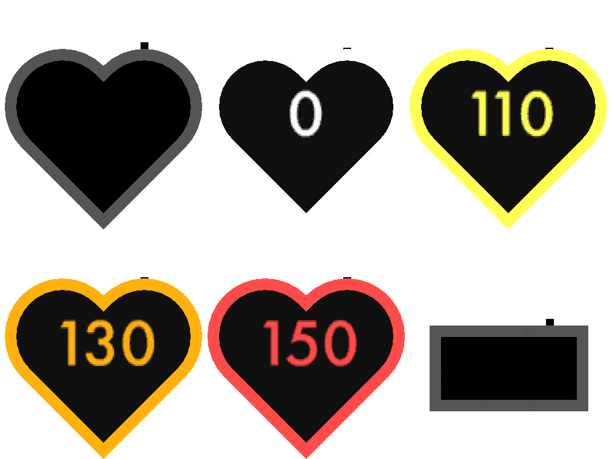

# VRChat Heartrate Monitor Prefab (Quest Compatible)

All that I ask is if you make any substantial changes that would benefit other players, please fork the repository and publish said changes. Preferably also make a pull request.

## Preview

## Setup
This project was meant to be used with [this](https://github.com/RichardVirgosky/VRChat-Heart-Rate-Monitor) OSC app, I do not plan to support any other OSC apps.

- Install the previously mentioned OSC app above, **make sure to leave the OSC parameter as the default in its settings (`heartRate`). Do not add it to you're avatar's parameters. VRCFury will merge it in on upload.**
- Install VRCFury using the VRC Creator Companion or Unity Package
- Install [Poiyomi shaders](https://github.com/poiyomi/PoiyomiToonShader/releases), or use the bundled ones... Which are probably horrifically out of date. 
- Make sure your avatar has at least 8 synced bits free in its parameters
- Install the unity package for this project (found in the releases page) or by clicking [here](https://github.com/32294/VRChat_Heart_Rate_Monitor_Prefab_Quest_Compatible/releases/download/1.1.0/heartrate_monitor.unitypackage) 
- Chose an appropriate prefab from the prefabs folder that best fits your needs
    - `prefabs/poiyomi` for PC and `prefabs/mobile` for quest 
    - square vs heart
    - autooff (turns off when at 0) vs non-autooff (stays on at 0 so you can look like you're dead)
- Place it somewhere on the avatar that you want it and adjust it's position/rotation as needed.
- Add the `heartrate_monitor_menu_toggle` prefab anywhere on the avatar to add a toggle to the menu for it if you want it. By default it is placed at the root of your menu, but you can edit's menu location by editing `prefix` in the VRCFury script in the prefab. **(this consumes 1 synced bit, make sure you have space)**
- Upload the avatar, VRCFury will merge all animations and parameters.
- **Make sure you have OSC enabled in the ingame Radial Menu**